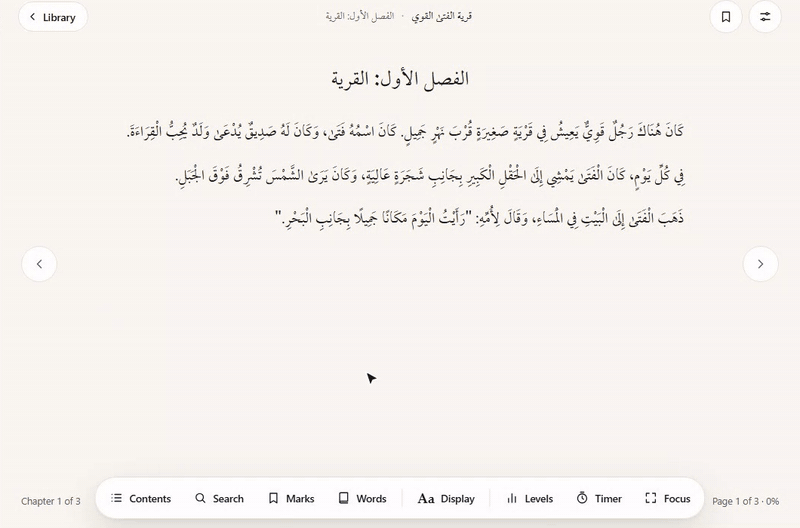
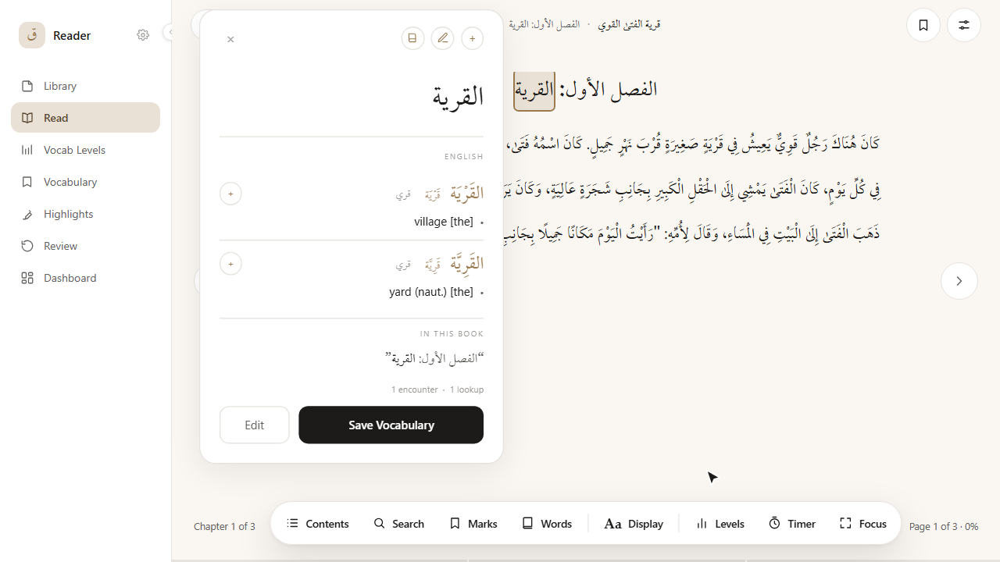
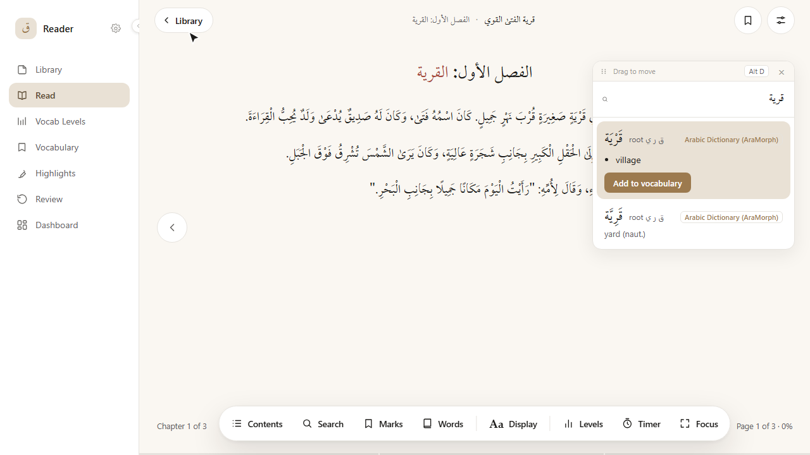
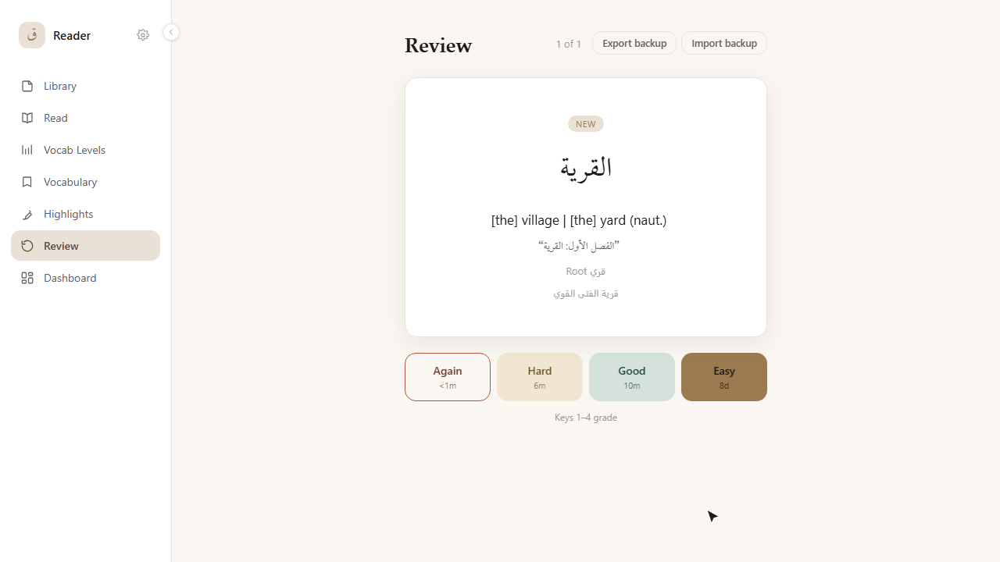

<div align="center">

# ق  Arabic Reader

**Reading Arabic should feel like reading, not like looking things up.**
Tap a word, see what it means, save it, and it comes back when you are about to forget it.

[](https://caasem.github.io/Arabic-Reader/)


[**Try it live**](https://caasem.github.io/Arabic-Reader/)



</div>

## Why

Reading in another language means constantly leaving the page: a dictionary, a translator, a word list, then
flashcards for later. Arabic Reader puts them in one place. Everything runs on your device, and nothing you read is
ever sent anywhere.

Open it in the browser, tap the install / "Add to Home Screen" option, and it is a real app on your phone or desktop.
No app store, no account. It can also be packaged as a native Android, iOS or desktop app.

## What it does

| Look up | Search without leaving the page | Remember |
| :---: | :---: | :---: |
|  |  |  |
| Tap any word for its root, form and meaning. | Press Alt+D to search the dictionary. | Saved words come back through spaced repetition. |

**Read**

- Opens any EPUB. Paginated or scrolling, single or two-column, right-to-left throughout.
- Footnotes resolve inline. Bookmarks and highlights save automatically.
- Focus mode fades the interface away and leaves just the page.

**Look up**

- About 136,000 offline dictionary entries are built in, with the root and morphological form, not just a translation.
- Verbs show their form (I–X) where the dictionary data gives one.
- Optional dictionaries (see below) add classical Arabic definitions and Arabic–Russian meanings.

**Remember**

- Every lookup is tracked, with how often you have seen the word and the sentence you found it in.
- Save a word in one tap and review it with FSRS, the spaced-repetition algorithm behind modern Anki.
- Sync saved words to a local Anki install.
- Vocabulary Levels grades every word in a book by real difficulty, using a frequency list built from a
  23,000-word classical Arabic corpus.

**Speed reading**

- A fullscreen RSVP mode for Arabic with an optimal recognition point and adjustable speed. Built and working, currently
  unlinked from navigation (`SPEED_READER_ENABLED` in `NavBar.tsx`).

**Your data**

- No account, no server. Everything lives in your browser or on your device.
- Export your library and vocabulary as a backup file and import it back later.

## Dictionaries

| Dictionary | Direction | Default |
| --- | --- | :---: |
| Arabic Dictionary (AraMorph) | Arabic → English | On |
| Al-Muʿjam al-Wasīṭ | Arabic → Arabic | Off |
| Al-Ṣiḥāḥ | Arabic → Arabic | Off |
| Maqāyīs al-Lugha | Arabic → Arabic | Off |
| Baranov | Arabic ↔ Russian | Off |

Turn the optional ones on in Settings → Dictionaries. Their data loads the first time you use them. Sources and
licensing notes are in [`NOTICE.md`](NOTICE.md).

## Keyboard

| Keys | Does |
| --- | --- |
| `Alt+D` | Search the dictionary |
| `Alt+S` | Search inside the book |
| `Alt+V` | Show this book's vocabulary |

## Getting started

```bash
npm install
npm run dev       # start the dev server
npm run build     # production build to dist/
npm run preview   # serve the production build locally
npm run lint      # oxlint
npm run test:unit # vitest
npm test          # run the Playwright end-to-end suite
```

Packaging for Android, iOS and desktop is covered in [`CONTRIBUTING.md`](CONTRIBUTING.md). Changes are listed in
[`CHANGELOG.md`](CHANGELOG.md).

## License

This project is licensed under the **GNU General Public License v2.0**. See [`LICENSE`](./LICENSE).

It bundles Arabic dictionary and morphological-analysis data derived from Tim Buckwalter's AraMorph analyzer (via the
Linguistic Data Consortium), which is itself GPLv2-licensed. Because the built app ships that data to your browser or
device, this repository's source is available here to meet the GPL's source requirement.

Every bundled data source, with its licence status, is listed in [`NOTICE.md`](NOTICE.md).
